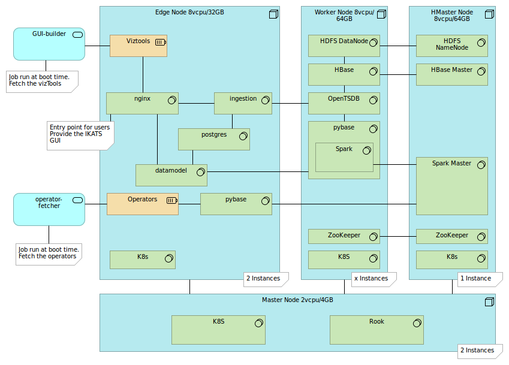
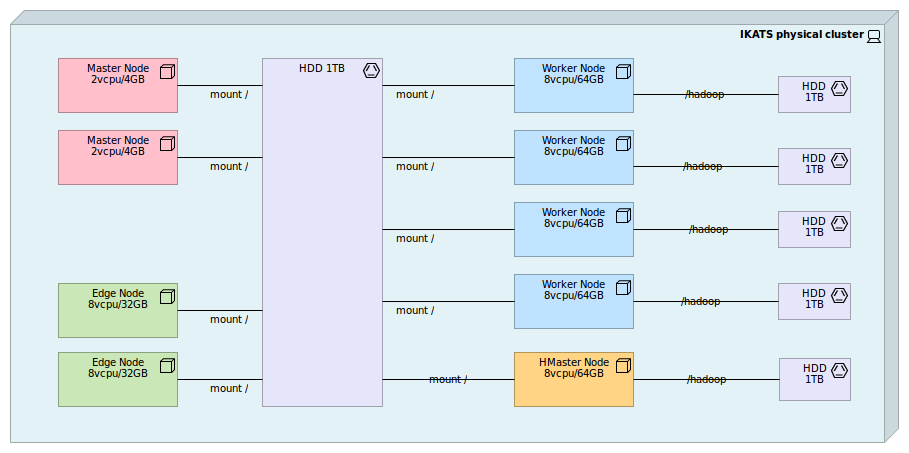

#  IKATS Main Architecture

IKATS project is composed of following github repositories:

- _IKATS environnement_
  - [ikats.github.io](https://github.com/IKATS/ikats.github.io): IKATS website
  - [ikats-sandbox](https://github.com/IKATS/ikats-sandbox): sandbox to play with IKATS
- _IKATS software core_:
  - [ikats-ingestion](https://github.com/IKATS/ikats-ingestion): IKATS data ingestion application
  - [ikats-datamodel](https://github.com/IKATS/ikats-datamodel): java resources API (and java algorithms)
  - [ikats-hmi](https://github.com/IKATS/ikats-hmi): IKATS Graphical User Interface (javascript)
  - [ikats-pybase](https://github.com/IKATS/ikats-pybase): python core of IKATS (for algorithms: catalog management and running engine)
  - [ikats-pyalgo](https://github.com/IKATS/ikats-pyalgo): python algorithms developed in IKATS
  - [ikats-baseimages](https://github.com/IKATS/ikats-baseimages): docker base stack components

## Logical infrastructure

IKATS is developed in a microservices achitecture, using [Docker](https://docs.docker.com/engine) as engine for building, storing (with [Docker Hub](https://hub.docker.com/)) and running images generated by IKATS.  
[kubernetes](https://kubernetes.io/) is used to deploy them on a cluster.  
These choices improve the **scalability** and the **reliability** of the application

IKATS is designed to be deployed on a cluster with following architecture:

  
**NB:**

- ikats-pybase is included in ikats-pyalgo when deployed
- ikats-base matches ikats-datamodel

## Physical infrastructure

In order to implement the above logical structure, IKATS can be deployed on a cluster composed of a set of virtual machines. You can use as many virtual machines as you need according to the needed computing power. For example, by deploying additional **Worker Nodes**, you increase the amount of data that can be computed and/or the computing celerity of algorithms and visualization tools.

**(This is an Example)**  
Following properties in terms of resource (vcpu/RAM per node) can be used for a cluster:

## Third party components

IKATS uses following components:

- HDFS Hbase
- Spark
- Scikit-learn
- Open TSDB
- PostgreSQL
- Numpy
- Docker
